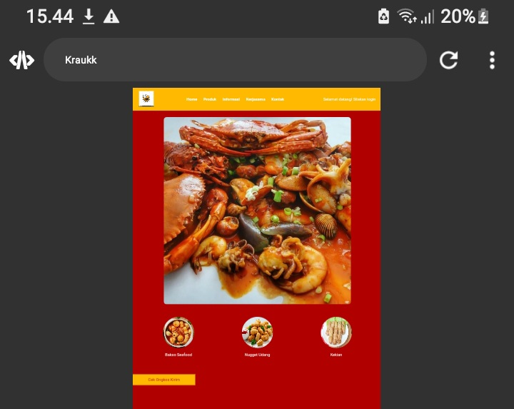

Tampilan web yang di dalam nya ada atribut z-index
1.Nama:ABD.RAHMAN 
2.Nama: muh zhafran rizki

# contoh program
```html
<!DOCTYPE html>
<html lang="en">
<head>
    <meta charset="UTF-8">
    <meta name="viewport" content="width=device-width, initial-scale=1.0">
    <title>Kraukk</title>
    <style>
        body {
            font-family: Arial, sans-serif;
            margin: 0;
            padding: 0;
            background-color: #b00000;
        }

        header {
            display: flex;
            justify-content: space-between;
            align-items: center;
            padding: 10px 20px;
            background-color: #ffba00;
        }

        .logo img {
            height: 50px;
        }

        nav ul {
            list-style: none;
            display: flex;
            margin: 0;
            padding: 0;
        }

        nav ul li {
            margin-right: 20px;
        }

        nav ul li a {
            text-decoration: none;
            color: #fff;
            font-weight: bold;
        }

        .login a {
            color: #fff;
            text-decoration: none;
        }

        .hero {
            display: flex;
            justify-content: center;
            align-items: center;
            background-color: #b00000;
            padding: 20px;
        }

        .hero img {
            width: 100%;
            max-width: 600px;
            border-radius: 10px;
        }

        .cta button {
            background-color: #ffba00;
            color: #b00000;
            border: none;
            padding: 10px 20px;
            font-size: 16px;
            cursor: pointer;
            margin-top: 20px;
            width: 200px;
        }
          

        .membership {
            display: flex;
            justify-content: center;
            padding: 20px;
        }

        .membership button {
            background-color: #ffba00;
            color: #b00000;
            border: none;
            padding: 10px 20px;
            font-size: 16px;
            cursor: pointer;
        }

        .products {
            display: flex;
            justify-content: space-around;
            padding: 20px;
            background-color: #b00000;
        }

        .product {
            text-align: center;
            color: #fff;
        }

        .product img {
            width: 100px;
            height: 100px;
            border-radius: 50%;
          
        }

        .product p {
            margin-top: 10px;
        }
    </style>
</head>
<body>
    <header>
        <div class="logo">
            
        </div>
        <nav>
            <ul>
                <li><a href="#">Home</a></li>
                <li><a href="#">Produk</a></li>
                <li><a href="#">Informasi</a></li>
                <li><a href="#">Kerjasama</a></li>
                <li><a href="#">Kontak</a></li>
            </ul>
        </nav>
        <div class="login">
            <a href="#">Selamat datang! Silakan login</a>
        </div>
    </header>
    <main>
        <section class="hero">
            
         
        </section>
        
        <section class="products">
            <div class="product">
                
                <p>Bakso Seafood</p>
            </div>
            <div class="product">
                
                <p>Nugget Udang</p>
            </div>
          
            <div class="product">
                
                <p>Kekian</p>
            </div>
            
        </section>
      <section>
           <div class="cta">
                <button>Cek Ongkos Kirim</button>
            </div>
      </section>  
    </main>
</body>
</html>

```

## HASIL 

## ANALISIS 
### Struktur HTML

#### Elemen `<head>`

- **`<meta charset="UTF-8">`**: Mengatur encoding karakter menjadi UTF-8.
- **`<meta name="viewport" content="width=device-width, initial-scale=1.0">`**: Membuat halaman web responsif dengan mengatur lebar viewport ke lebar perangkat.
- **`<title>Kraukk</title>`**: Menetapkan judul halaman menjadi "Kraukk".
- **`<style>`**: Menyediakan gaya CSS yang digunakan untuk merancang elemen halaman web.

#### Elemen `<body>`

- **`<header>`**: Bagian ini berisi logo, menu navigasi, dan tautan login.
    - **`.logo`**: Menyimpan gambar logo.
    - **`nav`**: Menyimpan menu navigasi berupa daftar tautan (Home, Produk, Informasi, Kerjasama, Kontak).
    - **`.login`**: Tautan login dengan teks "Selamat datang! Silakan login".
- **`<main>`**: Bagian utama halaman yang berisi tiga bagian utama.
    - **`<section class="hero">`**: Menampilkan gambar besar "Seafood Platter".
    - **`<section class="products">`**: Menampilkan tiga produk (Bakso Seafood, Nugget Udang, Kekian) dengan gambar dan teks.
    - **`<section>`**: Bagian ini memiliki tombol "Cek Ongkos Kirim".

### CSS (Cascading Style Sheets)

- **`body`**: Mengatur font (Arial), margin dan padding nol, dan latar belakang merah (#b00000).
- **`header`**: Mengatur header dengan fleksibel, spasi antara item, padding, dan latar belakang oranye (#ffba00).
    - **`.logo img`**: Mengatur tinggi gambar logo menjadi 50px.
    - **`nav ul`**: Mengatur daftar navigasi menjadi horizontal tanpa gaya list, margin, dan padding.
    - **`nav ul li`**: Mengatur margin kanan tiap item menjadi 20px.
    - **`nav ul li a`**: Mengatur gaya tautan (tidak bergaris bawah, warna putih, tebal).
    - **`.login a`**: Mengatur tautan login (tidak bergaris bawah, warna putih).
- **`section.hero`**: Mengatur bagian hero agar gambar ditampilkan di tengah, dengan padding 20px, latar belakang merah (#b00000).
    - **`.hero img`**: Mengatur gambar hero menjadi responsif, maksimal lebar 600px, sudut membulat (radius 10px).
- **`.cta button`**: Mengatur tombol di bagian CTA (Call To Action) dengan latar belakang oranye (#ffba00), teks merah (#b00000), tanpa border, padding 10px 20px, font 16px, kursor pointer, margin atas 20px, lebar 200px.
- **`section.membership`**: Mengatur bagian keanggotaan agar tombol ditampilkan di tengah, dengan padding 20px.
    - **`.membership button`**: Mengatur tombol keanggotaan seperti tombol CTA.
- **`section.products`**: Mengatur bagian produk agar gambar ditampilkan dengan spasi seimbang, dengan padding 20px, latar belakang merah (#b00000).
    - **`.product`**: Mengatur teks produk menjadi pusat, warna putih.
    - **`.product img`**: Mengatur gambar produk menjadi ukuran 100px x 100px, sudut membulat (radius 50%).
    - **`.product p`**: Mengatur margin atas teks menjadi 10px.

## KESIMPULAN 
Program ini adalah halaman web statis yang menampilkan informasi mengenai produk-produk seafood. Struktur dan gaya CSS diatur untuk memberikan tampilan yang menarik dan responsif. Elemen-elemen seperti header, navigasi, hero image, dan produk-produk diatur dengan baik untuk memastikan pengguna dapat dengan mudah menemukan informasi yang mereka cari. Desain menggunakan warna yang kontras (merah dan oranye) untuk menarik perhatian pengguna.