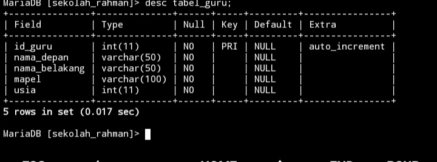
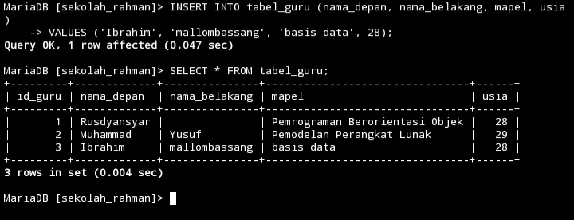

# query 1
**Membuat Tabel**:
```sql
CREATE TABLE tabel_guru (
    ->     id_guru INT AUTO_INCREMENT PRIMARY KEY,
    ->     nama_depan VARCHAR(50) NOT NULL,
    ->     nama_belakang VARCHAR(50) NOT NULL,
    ->     mapel VARCHAR(100) NOT NULL,
    ->     usia INT NOT NULL
    -> );

```

## HASIL 

 
## ANALISIS 

1. **CREATE TABLE tabel_guru:**
    
    - Perintah ini digunakan untuk membuat tabel baru bernama `tabel_guru`.
2. **id_guru INT AUTO_INCREMENT PRIMARY KEY:**
    
    - **id_guru:** Nama kolom.
    - **INT:** Tipe data integer (bilangan bulat).
    - **AUTO_INCREMENT:** Nilai kolom ini akan otomatis bertambah setiap kali data baru dimasukkan. Kolom ini tidak perlu diisi manual, database akan menambahkannya secara otomatis.
    - **PRIMARY KEY:** Kolom ini berfungsi sebagai kunci utama tabel, yang berarti setiap nilai dalam kolom ini harus unik dan tidak boleh null. Kunci utama digunakan untuk mengidentifikasi setiap baris data secara unik dalam tabel.
3. **nama_depan VARCHAR(50) NOT NULL:**
    
    - **nama_depan:** Nama kolom.
    - **VARCHAR(50):** Tipe data karakter dengan panjang maksimum 50 karakter.
    - **NOT NULL:** Kolom ini tidak boleh kosong, harus diisi dengan nilai.
4. **nama_belakang VARCHAR(50) NOT NULL:**
    
    - **nama_belakang:** Nama kolom.
    - **VARCHAR(50):** Tipe data karakter dengan panjang maksimum 50 karakter.
    - **NOT NULL:** Kolom ini tidak boleh kosong, harus diisi dengan nilai.
5. **mapel VARCHAR(100) NOT NULL:**
    
    - **mapel:** Nama kolom.
    - **VARCHAR(100):** Tipe data karakter dengan panjang maksimum 100 karakter.
    - **NOT NULL:** Kolom ini tidak boleh kosong, harus diisi dengan nilai.
6. **usia INT NOT NULL:**
    
    - **usia:** Nama kolom.
    - **INT:** Tipe data integer (bilangan bulat).
    - **NOT NULL:** Kolom ini tidak boleh kosong, harus diisi dengan nilai.

# query 2
**memasukkan data**:
```sql
INSERT INTO tabel_guru (nama_depan, nama_belakang, mapel, usia)
VALUES 
    ('Rusdyansyar', '', 'Pemrograman Berorientasi Objek', 28),
    ('Muhammad', 'Yusuf', 'Pemodelan Perangkat Lunak', 29);

```
## HASIL 


ANALISIS 
- `CREATE TABLE tabel_guru`: Membuat tabel `tabel_guru` dengan kolom-kolom berikut:
    - `id_guru`: Tipe data `INT` dengan auto increment yang berfungsi sebagai primary key.
    - `nama_depan`: Tipe data `VARCHAR(50)`, tidak boleh kosong (`NOT NULL`).
    - `nama_belakang`: Tipe data `VARCHAR(50)`, tidak boleh kosong (`NOT NULL`).
    - `mapel`: Tipe data `VARCHAR(100)`, tidak boleh kosong (`NOT NULL`).
    - `usia`: Tipe data `INT`, tidak boleh kosong (`NOT NULL`).

# QUERY3
**menambahkan satu baris data**:
```sql
​INSERT INTO tabel_guru (nama_depan, nama_belakang, mapel, usia)
    -> VALUES ('Ibrahim', 'mallombassang', 'basis data', 28);

```
## HASIL 


## ANALISIS 
- `INSERT INTO tabel_guru (nama_depan, nama_belakang, mapel, usia) VALUES ...`: Menambahkan satu baris data baru ke dalam tabel `tabel_guru`.
    - Baris: `nama_depan` = 'Ibrahim', `nama_belakang` = 'mallombassang', `mapel` = 'basis data', `usia` = 28.

# Query 4
**menampilkan data dari 'Rusdyansyar ' saja**:
```sql
SELECT * FROM tabel_guru WHERE nama_depan = 'Rusdyansyar';

```
## HASIL 
![[Screenshot_20240602-104340_Termux.jpg]]

## ANALISIS 
- `SELECT * FROM tabel_guru WHERE nama_depan = 'Rusdyansyar';`: Menampilkan semua kolom dari baris yang memiliki `nama_depan` = 'Rusdyansyar'.

# Query 5
**Mengganti `nama_belakang` untuk `id_guru` yang Bernilai "2" menjadi "Ganteng":
```sql

UPDATE tabel_guru
SET nama_belakang = 'Ganteng'
WHERE id_guru = 3;

SELECT * FROM tabel_guru;

```
## HASIL 
![[REMEDIAL BASIS DATA/Aset11/IMG3.jpg]]
## ANALISIS 
- `UPDATE tabel_guru SET nama_belakang = 'Ganteng' WHERE id_guru = 3;`: Mengubah nilai `nama_belakang` menjadi 'Ganteng' untuk baris yang memiliki `id_guru` = 3.
- `SELECT * FROM tabel_guru;`: Menampilkan semua data dalam tabel `tabel_guru` untuk memverifikasi perubahan.

# query 6
**menghapus data**:
```sql
DELETE FROM tabel_guru
WHERE nama_depan = 'Ibrahim' AND nama_belakang = 'Ganteng';

SELECT * FROM tabel_guru;

```

## HASIL 
![[Screenshot_20240602-105527_Termux.jpg]]

## ANALISIS 
- `DELETE FROM tabel_guru WHERE nama_depan = 'Ibrahim' AND nama_belakang = 'Ganteng';`: Menghapus baris yang memiliki `nama_depan` = 'Ibrahim' dan `nama_belakang` = 'Ganteng`.
- `SELECT * FROM tabel_guru;`: Menampilkan semua data dalam tabel `tabel_guru` untuk memverifikasi penghapusan.

# query 7
**Menampilkan Data dengan `usia` Kurang dari 30**:
```sql
SELECT * FROM tabel_guru
WHERE usia < 30 AND mapel LIKE 'Pem%'
ORDER BY usia ASC;

```
## HASIL 
![[Screenshot_20240602-105908_Termux.jpg]]

## ANALISIS 
- `SELECT * FROM tabel_guru WHERE usia < 30 AND mapel LIKE 'Pem%' ORDER BY usia ASC;`: Menampilkan semua kolom dari baris yang memiliki `usia` kurang dari 30 dan `mapel` yang dimulai dengan 'Pem', diurutkan berdasarkan `usia` dalam urutan menaik (ASC).

# query 8
**Penggabungan Kolom**:
```sql
SELECT CONCAT(nama_depan, ' ', nama_belakang) AS nama_lengkap FROM tabel_guru;

```
## HASIL 
![[REMEDIAL BASIS DATA/Aset11/IMG5.jpg]]
## ANALISIS 
- **CONCAT**: Fungsi ini digunakan untuk menggabungkan beberapa string menjadi satu string. Dalam kasus ini, menggabungkan kolom `nama_depan` dan `nama_belakang` dengan tambahan spasi (' ') di antara keduanya.
- **Alias (AS nama_lengkap)**: Memberikan nama sementara `nama_lengkap` pada hasil gabungan tersebut.
- **Hasil yang Diharapkan**: Anda akan mendapatkan sebuah kolom baru yang menampilkan nama lengkap (gabungan dari `nama_depan` dan `nama_belakang`), seperti contoh yang diberikan (Muhammad Yusuf, Rusdyansyar).

# query 9
**Seleksi data** :
```sql
SELECT nama_depan, usia 
FROM tabel_guru 
ORDER BY usia DESC 
LIMIT 1;

```

## HASIL 
![[REMEDIAL BASIS DATA/Aset11/IMG6.jpg]]

## ANALISIS 

- **SELECT**: Memilih kolom yang akan ditampilkan (`nama_depan` dan `usia`).
- **FROM**: Menentukan tabel sumber data (`tabel_guru`).
- **ORDER BY usia DESC**: Mengurutkan hasil berdasarkan kolom `usia` secara menurun (dari yang paling tua ke yang paling muda).
- **LIMIT 1**: Membatasi hasil query untuk menampilkan hanya satu baris (guru dengan usia paling tua).